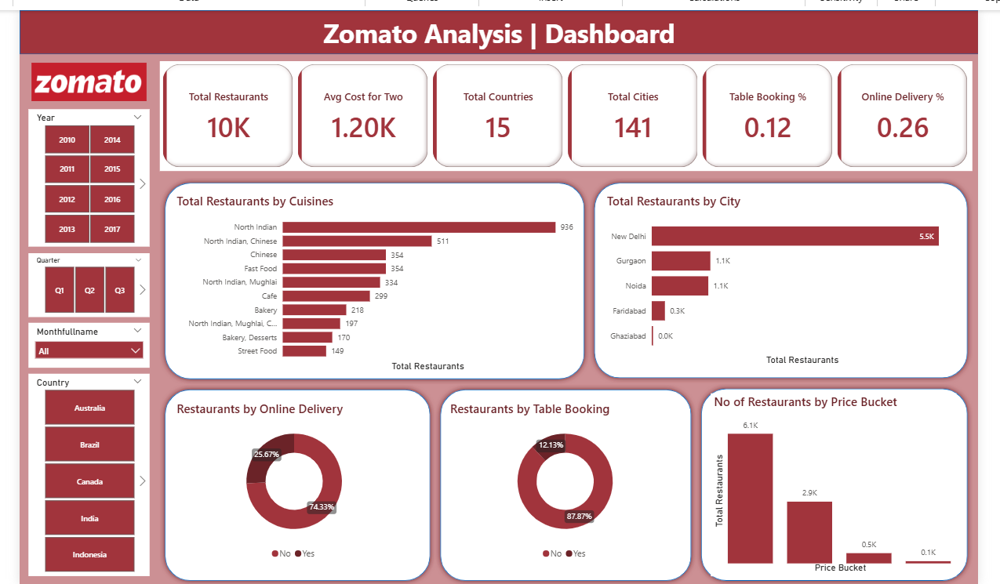

# 🍽️ Zomato Restaurant Analysis

## 📊 Project Overview

This project analyzes **Zomato restaurant data** to understand restaurant distribution, cuisine popularity, pricing trends, and online delivery availability.

Using **Power BI**, the project transforms raw data into an **interactive dashboard** that helps analyze restaurant trends across different cities and countries.

---

# 🛠 Tools & Technologies

* **Power BI** – Data visualization and dashboard creation
* **Power Query** – Data cleaning and transformation
* **Data Modeling** – Creating relationships between tables

---

# 📂 Dataset Description

The dataset contains restaurant-level information including:

* Restaurant Name
* City
* Country
* Cuisine Types
* Average Cost for Two
* Online Delivery Availability
* Table Booking Availability
* Price Range

---

# 📊 Key KPIs

The dashboard tracks the following metrics:

* **Total Restaurants:** 10K
* **Average Cost for Two:** 1.20K
* **Total Countries:** 15
* **Total Cities:** 141
* **Table Booking %:** 12%
* **Online Delivery %:** 26%

---

# 📈 Dashboard Insights

Key findings from the analysis:

* **North Indian cuisine** has the highest number of restaurants.
* **New Delhi** has the largest restaurant concentration.
* Only **26% of restaurants offer online delivery**.
* Most restaurants fall in the **lower price category**.

---

# 📊 Dashboard Preview

# 🎯 Conclusion

The analysis helps understand **restaurant market trends, cuisine popularity, and delivery behavior**, which can help businesses make better strategic decisions.

---

# 👩‍💻 Author

**Apeksha Sonawane**
Aspiring **Data Analyst**

Skills:
SQL • Excel • Power BI • Tableau • Data Visualization

---

